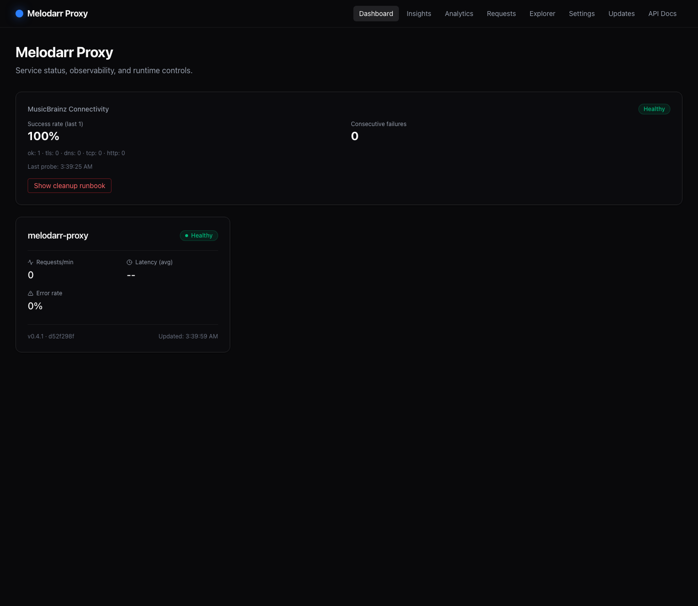
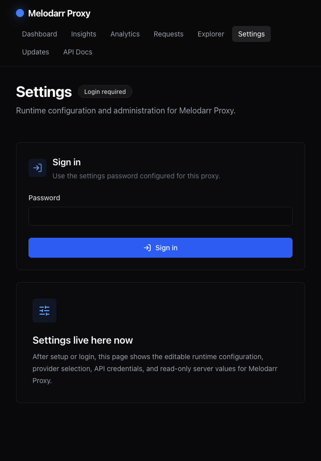
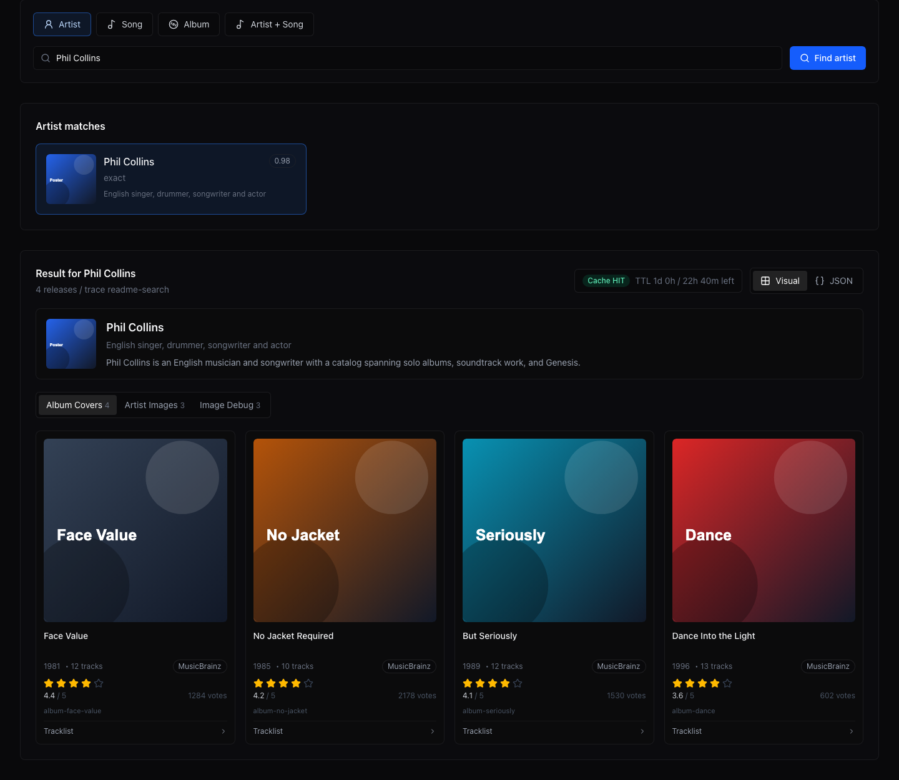

# Melodarr Proxy

[](https://github.com/melodarr/melodarr-proxy/actions/workflows/ci.yml)
[](https://github.com/melodarr/melodarr-proxy/actions/workflows/release.yml)
[](https://github.com/melodarr/melodarr-proxy/releases)
[](https://github.com/melodarr/melodarr-proxy/pkgs/container/melodarr-proxy)
[](https://github.com/melodarr/melodarr-proxy/pkgs/container/melodarr-proxy-melodash)
[](LICENSE)

Melodarr Proxy is a lightweight, self-hostable music metadata proxy for Lidarr-style clients and Melodarr automation. It queries live metadata providers, normalizes responses into a Lidarr/SkyHook-compatible shape, caches results, and exposes an operator dashboard called **Melodash**.

The project is intentionally small: no local MusicBrainz database, no Solr index, and no heavyweight metadata stack.

## What Runs

The standard deployment has three containers:

| Service | Purpose | Default host port |
| --- | --- | --- |
| `proxy` | Metadata API, health checks, Scalar docs, provider diagnostics, runtime settings API | `3055` |
| `melodash` | Operator UI for dashboard, settings, explorer, requests, analytics, docs, and updates | `55026` |
| `redis` | Shared cache for metadata lookups | internal only |

Published images:

```text
ghcr.io/melodarr/melodarr-proxy
ghcr.io/melodarr/melodarr-proxy-melodash
```

See [docs/architecture.md](docs/architecture.md) for the runtime diagram covering Lidarr, Melodash, Redis, providers, provider scoring, health, and circuit breaker flow.

## Features

- Lidarr-style artist lookup, artist discovery, search, and song-to-album discovery
- MusicBrainz, iTunes, TheAudioDB, Last.fm, Discogs, and custom provider support
- Visual custom-provider mapping builder in Melodash
- Redis cache with in-memory fallback
- Provider scoring, circuit breaker protection, and conservative auto-reenable after recovery
- Request tracing, upstream diagnostics, provider health, provider metrics, and cache visibility
- Scalar API docs from the live OpenAPI document
- Melodash UI for settings, provider testing, logs, request details, explorer, updates, and runtime controls
- Docker Compose and Proxmox LXC install/update scripts

## Screenshots

| Dashboard | Settings | Explorer |
| --- | --- | --- |
|  |  |  |

## Quick Start

The easiest local path is the management menu. It creates the Docker network expected by Compose and starts the proxy, Redis, and Melodash.

```bash
cp .env.example .env
./manage.sh
```

Choose:

```text
1) Start services
```

Or start manually:

```bash
cp .env.example .env
docker compose up -d --build proxy redis melodash
```

For deployments that need the external IPv6 Docker network used by older
Melodarr installs:

```bash
docker network create --ipv6 --subnet fd00:dead:beef:1::/64 melodarr-ipv6
docker compose -f docker-compose.yml -f docker-compose.ipv6.yml up -d --build proxy redis melodash
```

`manage.sh` and the Compose smoke test use the self-contained default network
unless `USE_IPV6_NETWORK=1` is set.

Check active endpoints:

```bash
docker compose ps
docker compose port proxy 3000
docker compose port melodash 3000
```

Defaults:

```text
Proxy API: http://localhost:3055
Melodash:  http://localhost:55026
API docs:  http://localhost:3055/docs
```

## Verify

```bash
curl http://localhost:3055/api/health
curl http://localhost:3055/api/ready
curl http://localhost:3055/openapi.json
```

Expected:

- `/api/health` returns liveness: the process is running.
- `/api/ready` returns readiness: Redis, upstream/provider state, memory, mode, and provider scores.
- `/docs` serves Scalar API documentation.

Create an API key from Melodash settings, then verify metadata lookup:

```bash
curl \
  -H "X-Api-Key: mp_your_key_here" \
  "http://localhost:3055/api/v1/artist/lookup?term=radiohead"
```

## Melodash

Melodash is the primary operator dashboard. It is a separate Next.js app and image; the proxy image remains API-first and only serves lightweight docs/legacy utility pages.

Image:

```text
ghcr.io/melodarr/melodarr-proxy-melodash
```

Default URL:

```text
http://localhost:55026
```

Main pages:

- `/dashboard` shows service status, readiness, provider/cache state, and runtime controls.
- `/settings` manages identity, provider order, provider credentials, API keys, custom providers, and provider tests.
- `/explorer` searches by artist, song, album, or artist + song and shows image or raw JSON views.
- `/requests` shows recent request traces and timing details.
- `/analytics` shows request/provider charts.
- `/insights` shows health and provider observations.
- `/docs` links to the proxy OpenAPI/Scalar docs.
- `/updates` shows release status, changelog, and update actions when a git checkout is mounted.

Melodash talks to the proxy through:

```env
PROXY_API_URL=http://proxy:3000/api
```

In the standard Compose deployment, `melodash` and `proxy` share the same Docker network. Melodash uses the internal service URL `http://proxy:3000/api`; browsers use the exposed Melodash port `55026`.

Minimal image-based deployment:

```yaml
services:
  proxy:
    image: ghcr.io/melodarr/melodarr-proxy:latest
    restart: unless-stopped
    environment:
      PORT: 3000
      REDIS_URL: redis://redis:6379
      REQUIRE_API_KEY: "true"
      DATA_DIR: /data
      MUSICBRAINZ_BASE_URL: https://musicbrainz.org/ws/2
      MUSICBRAINZ_IP_FAMILY: "6"
      METADATA_PROVIDERS: musicbrainz,itunes
      PROVIDER_PRIORITY: musicbrainz,theaudiodb,itunes,lastfm,discogs
    ports:
      - "3055:3000"
    volumes:
      - melodarr_proxy_data:/data
    depends_on:
      - redis

  redis:
    image: redis:7-alpine
    restart: unless-stopped
    command: ["redis-server", "--save", "", "--appendonly", "no", "--maxmemory", "256mb", "--maxmemory-policy", "allkeys-lru"]

  melodash:
    image: ghcr.io/melodarr/melodarr-proxy-melodash:latest
    restart: unless-stopped
    environment:
      PORT: 3000
      PROXY_API_URL: http://proxy:3000/api
    ports:
      - "55026:3000"
    depends_on:
      - proxy

volumes:
  melodarr_proxy_data:
```

Start all three services together:

```bash
docker compose up -d proxy redis melodash
```

Verify:

```bash
curl http://localhost:3055/api/health
curl http://localhost:3055/api/ready
```

Then visit `http://localhost:55026/dashboard`.

For browser-side reverse proxy deployments, set:

```env
NEXT_PUBLIC_PROXY_BASE_URL=https://melodarr-proxy.example.com
NEXT_PUBLIC_PROXY_FALLBACK=http://localhost:3055
```

## Configuration

Copy `.env.example`:

```bash
cp .env.example .env
```

Common variables:

| Variable | Purpose |
| --- | --- |
| `HOST_PORT` | Proxy host port. Default local examples use `3055`; `0` asks Docker for a random port. |
| `MELODASH_HOST_PORT` | Melodash host port. Default `55026`. |
| `REDIS_URL` | Cache backend URL. Compose uses `redis://redis:6379`. |
| `ADMIN_PASSWORD` | Optional preconfigured settings password. If empty, first-run setup creates it. |
| `REQUIRE_API_KEY` | Require API keys for metadata endpoints. Default `true` in Compose. |
| `APP_NAME`, `APP_VERSION`, `APP_CONTACT` | MusicBrainz User-Agent identity. `APP_CONTACT` should be a real contact email or URL. |
| `MUSICBRAINZ_BASE_URL` | MusicBrainz API base URL. |
| `MUSICBRAINZ_IP_FAMILY` | `6`, `4`, or unset/auto depending on network. Useful for Proxmox/LXC TLS reset troubleshooting. |
| `CACHE_TTL_SECONDS` | Metadata cache TTL. Compose default is one day. |
| `METADATA_PROVIDERS` | Enabled providers, comma-separated. Default `musicbrainz,itunes`. |
| `PROVIDER_PRIORITY` | Merge/fallback preference when providers disagree. |
| `PROVIDER_FAILURE_THRESHOLD` | Consecutive failures before a provider is disabled. Default `3`. |
| `PROVIDER_COOLDOWN_MS` | Disabled-provider canary cooldown. Default `600000`. |
| `PROVIDER_REENABLE_SUCCESS_THRESHOLD` | Successes required before reenable. Default `3`. |
| `PROVIDER_REENABLE_WINDOW_MS` | Time window for those successes. Default `300000`. |
| `THEAUDIODB_API_KEY`, `LASTFM_API_KEY`, `DISCOGS_TOKEN` | Optional provider credentials. |
| `ITUNES_COUNTRY` | iTunes storefront country. Default `US`. |
| `ALERT_SLACK_WEBHOOK` | Optional Slack webhook for provider-disabled alerts. |

Provider details are documented in [docs/providers.md](docs/providers.md).

## Providers

Default provider set:

```env
METADATA_PROVIDERS=musicbrainz,itunes
PROVIDER_PRIORITY=musicbrainz,theaudiodb,itunes,lastfm,discogs
```

Provider summary:

| Provider | Credential | Notes |
| --- | --- | --- |
| `musicbrainz` | `MUSICBRAINZ_API_KEY` when using paid/authenticated MusicBrainz-compatible access; public API works without one | Canonical artist/release IDs and release groups. |
| `itunes` | none | Fast catalog fallback and artwork. |
| `theaudiodb` | `THEAUDIODB_API_KEY` | Artist/album enrichment and artwork. |
| `lastfm` | `LASTFM_API_KEY` | Tags, popularity, scrobbler metadata, and images. |
| `discogs` | `DISCOGS_TOKEN` | Release years, labels, discography data. |
| custom | configured in Melodash | Custom API endpoint with visual JSON mapping. |

Provider health is adaptive. A failing provider can be degraded or disabled without changing response shapes. Disabled providers are only reintroduced after multiple successful canary calls inside the configured reenable window.

## API

See [docs/api.md](docs/api.md) or the live Scalar docs:

```text
http://localhost:3055/docs
```

Live OpenAPI:

```text
http://localhost:3055/openapi.json
```

Metadata endpoints accept an API key in either a header:

```text
X-Api-Key: mp_...
```

or a query parameter:

```text
api_key=mp_...
```

Path-based API-key routes are also supported for Lidarr/plugin compatibility:

```text
http://localhost:3055/api/mp_your_key_here/v1/artist/lookup?term=radiohead
```

Common endpoints:

| Endpoint | Purpose |
| --- | --- |
| `GET /api/health` | Liveness check. |
| `GET /api/ready` | Readiness, Redis, upstream/provider state, memory, and provider scores. |
| `GET /api/version` | Version and build identity. |
| `GET /api/search?q=radiohead` | Lidarr/SkyHook search shape. |
| `GET /api/v1/artist/lookup?term=radiohead` | Normalized artist and album lookup. |
| `GET /api/v0.4/artist/lookup?term=radiohead` | Compatibility alias. |
| `GET /api/v1/artist/discover?q=paranoid%20android&type=song` | Discover artists from artist, song, or album text. |
| `GET /api/v1/song/albums?artist=Dave%20Edmunds&song=I%20Hear%20You%20Knocking` | Find albums containing a song by a known artist. |

Response headers include:

- `X-Cache`: `HIT` or `MISS`
- `X-Providers`: providers used for the response
- `X-Cache-Generated-At`: timestamp for cached responses when available
- `X-Request-Id`: correlation id for logs and `/debug/upstream`

## Diagnostics

Operator/debug endpoints:

| Endpoint | Purpose |
| --- | --- |
| `GET /debug/overview` | Dashboard overview data. |
| `GET /debug/requests` | Recent request traces. |
| `GET /debug/requests/:id` | Request detail. |
| `GET /debug/providers` | Active provider config list. |
| `GET /debug/providers/health` | Circuit-breaker state and provider scores. |
| `GET /debug/providers/metrics` | Raw and decayed provider metrics. |
| `GET /debug/cache` | Cache state. |
| `GET /debug/upstream` | Upstream attempt ring buffer; supports `requestId`, `provider`, and `limit`. |
| `GET /debug/diagnose?provider=musicbrainz` | DNS/TCP/TLS/HTTP/parse diagnostic for MusicBrainz. |
| `POST /debug/test-provider` | Custom-provider test mode: raw response, mapped result, and mapping errors. |

Command-line diagnostics:

```bash
./manage.sh
# choose 12) Run proxy diagnostics
```

or:

```bash
scripts/proxy-diag.sh all
scripts/proxy-diag.sh ready
scripts/proxy-diag.sh mb 6
scripts/proxy-diag.sh mb 4
curl "http://localhost:3055/debug/diagnose?provider=musicbrainz"
```

## Cache

Redis is the primary cache. If Redis is unavailable, the proxy falls back to in-memory cache so metadata requests can still work.

Compose defaults:

```env
CACHE_TTL_SECONDS=86400
```

That is one day. Longer TTLs, such as one or two weeks, can be reasonable for mostly-stable music metadata, but they delay provider corrections and artwork updates. Use a longer TTL when stability and fewer upstream calls matter more than freshness.

Clear cache:

```bash
curl -X POST http://localhost:3055/api/cache/clear
```

or use Melodash.

## Proxmox LXC

Create a Debian LXC, install Docker inside it, and start proxy + Redis + Melodash:

```bash
bash scripts/install-proxmox-lxc.sh
```

Run it as `root` on the Proxmox host. Review settings at the top of the script first, especially:

- `PASSWORD`
- `APP_CONTACT`
- `STORAGE`
- `BRIDGE`
- `TEMPLATE_FILE`

The Debian template must already exist on the Proxmox host:

```bash
pveam update
pveam available | grep debian-12
pveam download local debian-12-standard_12.12-1_amd64.tar.zst
```

Common override:

```bash
CTID=3055 HOST_PORT=3055 MELODASH_HOST_PORT=55026 APP_CONTACT=you@example.com bash scripts/install-proxmox-lxc.sh
```

Upgrade an existing LXC:

```bash
CTID=163 ./scripts/upgrade-proxmox-lxc.sh
```

The upgrade script pulls both images, runs canary validation, keeps the main container untouched on failed app validation, and can continue when MusicBrainz is unreachable so long as the application health checks pass.

## MusicBrainz Connectivity

Some Proxmox/LXC/Docker networks can reach MusicBrainz over one IP family but fail on the other. Common symptoms:

```text
Client network socket disconnected before secure TLS connection was established
ECONNRESET
ENETUNREACH
```

Check readiness:

```bash
curl -s http://localhost:3055/api/ready
```

Run targeted diagnostics:

```bash
curl "http://localhost:3055/debug/diagnose?provider=musicbrainz"
scripts/proxy-diag.sh diagnose
scripts/proxy-diag.sh mb 6
scripts/proxy-diag.sh mb 4
```

The diagnose response includes DNS results, selected address/family, TCP/TLS phase timings, low-level socket error fields, and side-by-side `auto`, IPv4, and IPv6 probes. Use `failedStep` to distinguish DNS, TCP routing, TLS reset, HTTP status, and JSON parse failures.

Then set:

```env
MUSICBRAINZ_IP_FAMILY=6
```

or, only when IPv6 is unavailable:

```env
MUSICBRAINZ_IP_FAMILY=4
```

If MusicBrainz remains unreachable, Melodarr Proxy can still serve fallback providers when enabled, but readiness will show degraded while MusicBrainz is part of `METADATA_PROVIDERS`.

## Updates

Melodash includes an Updates page. It shows:

- current version
- latest GitHub release
- changelog
- whether an update is available
- whether this install can run the update action

The in-app update runner requires:

- a mounted git checkout
- `git`
- Docker Compose
- permission to rebuild and restart `proxy`, `redis`, and `melodash`

For image-based installs, use the provided update scripts instead:

```bash
scripts/melodarr-update.sh
CTID=163 ./scripts/upgrade-proxmox-lxc.sh
```

## Local Development

Proxy:

```bash
yarn install
yarn dev
```

Melodash:

```bash
cd melodash
yarn install
yarn dev
```

Run checks locally:

```bash
yarn lint
yarn test
yarn test:e2e

cd melodash
yarn run lint
yarn run build
```

Run checks inside containers:

```bash
./manage.sh
# choose 8, 9, 10, or 11
```

Package scripts:

```bash
yarn docker:lint
yarn docker:test
```

## Lidarr Compatibility

See [docs/lidarr-compatibility.md](docs/lidarr-compatibility.md) and [docs/lidarr-setup.md](docs/lidarr-setup.md).

Stock Lidarr builds generally use Lidarr's built-in metadata service and do not expose a simple metadata-server URL field. To change artist lookup traffic to Melodarr Proxy, use a Lidarr build with plugin support and configure a custom metadata source through a plugin such as Tubifarry.

Start Melodarr Proxy and confirm the port:

```bash
docker compose up -d proxy redis melodash
docker compose port proxy 3000
```

Verify:

```bash
curl http://localhost:3055/api/health
curl \
  -H "X-Api-Key: mp_your_key_here" \
  "http://localhost:3055/api/v1/artist/lookup?term=radiohead"
```

If Lidarr runs in Docker Compose, switch it to a plugin-capable image before installing the metadata plugin. Back up Lidarr's `/config` volume first because plugin/nightly branches may run database migrations.

```yaml
services:
  lidarr:
    image: ghcr.io/hotio/lidarr:pr-plugins
    container_name: lidarr
    ports:
      - "8686:8686"
    volumes:
      - /path/to/lidarr/config:/config
      - /path/to/music:/music
```

Apply the image change:

```bash
docker compose pull lidarr
docker compose up -d lidarr
```

Install Tubifarry:

```text
System -> Plugins -> GitHub URL -> Install
https://github.com/TypNull/Tubifarry
```

Configure the custom metadata source:

```text
Settings -> Metadata -> Lidarr Custom
Metadata URL: http://<melodarr-host>:3055
API key: mp_your_key_here
```

If Lidarr and Melodarr Proxy are in the same Compose network, use the Compose service name instead of `localhost`:

```text
http://proxy:3000
```

If the client cannot preserve query parameters, use the path API-key form:

```text
http://proxy:3000/api/mp_your_key_here
```

## Documentation

- [docs/api.md](docs/api.md)
- [docs/architecture.md](docs/architecture.md)
- [docs/backup-restore.md](docs/backup-restore.md)
- [docs/branding.md](docs/branding.md)
- [docs/providers.md](docs/providers.md)
- [docs/deployment.md](docs/deployment.md)
- [docs/deployment-safety.md](docs/deployment-safety.md)
- [docs/production-install.md](docs/production-install.md)
- [docs/release-support.md](docs/release-support.md)
- [docs/reverse-proxy.md](docs/reverse-proxy.md)
- [docs/supply-chain-security.md](docs/supply-chain-security.md)
- [docs/troubleshooting.md](docs/troubleshooting.md)
- [docs/lidarr-setup.md](docs/lidarr-setup.md)
- [docs/lidarr-compatibility.md](docs/lidarr-compatibility.md)
- [docs/platform-architecture.md](docs/platform-architecture.md)
- [docs/testing.md](docs/testing.md)
- [ROADMAP.md](ROADMAP.md)
- [CHANGELOG.md](CHANGELOG.md)
- [GOVERNANCE.md](GOVERNANCE.md)
- [MAINTAINERS.md](MAINTAINERS.md)

## Contributing

See [CONTRIBUTING.md](CONTRIBUTING.md).

## Security

See [SECURITY.md](SECURITY.md).

## License

MIT
