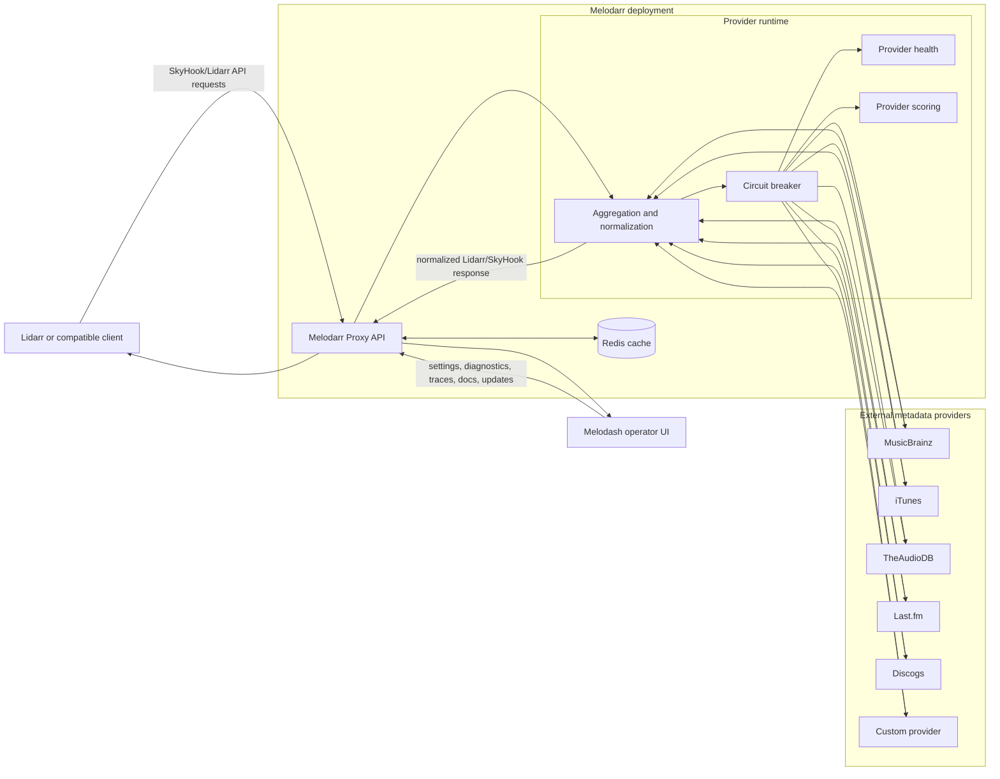

# Architecture

Melodarr Proxy has three runtime services:

- `proxy`: API service used by Lidarr-compatible clients and Melodash.
- `melodash`: operator dashboard for status, settings, provider tests, request traces, docs, and updates.
- `redis`: shared metadata cache.

## Runtime Diagram



## Request Flow

1. Lidarr calls the proxy using a Lidarr/SkyHook-compatible endpoint.
2. The proxy checks Redis for a cached response.
3. On a cache miss, the proxy calls enabled providers through the provider runtime.
4. The circuit breaker skips providers that are disabled or cooling down.
5. Provider health records successes, failures, degraded state, disabled state, and conservative auto-reenable state.
6. Provider metrics and scoring influence merge preference when multiple providers return data.
7. The aggregator normalizes provider data into the stable response shape expected by Lidarr.
8. The proxy writes cacheable results to Redis and returns the normalized response.

## Melodash Flow

Melodash does not replace the proxy and does not talk to providers directly. It calls the proxy API for:

- `/api/health` and `/api/ready`
- provider health and provider metrics
- runtime settings
- provider tests
- request traces and upstream diagnostic logs
- OpenAPI/Scalar docs
- update status and update actions

In Docker Compose, Melodash uses the internal service URL:

```env
PROXY_API_URL=http://proxy:3000/api
```

Browsers access Melodash through the published host port:

```text
http://localhost:55026
```

## Cache Model

Redis is the primary metadata cache. The cache stores lookup results so repeated Lidarr or explorer requests do not hit upstream providers every time.

If Redis is unavailable:

- `/api/health` can remain `ok` because the process is alive.
- `/api/ready` reports degraded cache readiness.
- the proxy falls back to in-memory cache.
- metadata lookups can still work, but cache state is not shared across proxy instances.

The default cache TTL is controlled by:

```env
CACHE_TTL_SECONDS=86400
```

## Provider Health, Scoring, and Circuit Breaker

Provider calls are wrapped by the safe provider runtime:

- validates provider result shape before aggregation
- records latency, successes, and failures
- moves failing providers from `healthy` to `degraded` to `disabled`
- skips disabled providers during normal aggregation
- allows canary attempts after cooldown
- only auto-reenables after multiple recent successes
- reenables conservatively as `degraded`, not `healthy`

Related settings:

```env
PROVIDER_FAILURE_THRESHOLD=3
PROVIDER_COOLDOWN_MS=600000
PROVIDER_REENABLE_SUCCESS_THRESHOLD=3
PROVIDER_REENABLE_WINDOW_MS=300000
PROVIDER_PRIORITY=musicbrainz,theaudiodb,itunes,lastfm,discogs
```

The scoring layer does not change API response shape. It only influences which provider's values win when multiple providers return valid data for the same artist or album.

## Ports

| Service | Container port | Default host port | Purpose |
| --- | --- | --- | --- |
| `proxy` | `3000` | `3055` | Metadata API, docs, health, diagnostics |
| `melodash` | `3000` | `55026` | Operator dashboard |
| `redis` | `6379` | internal only | Shared cache |

## Failure Boundaries

| Failure | Expected behavior |
| --- | --- |
| Redis down | Proxy uses memory fallback; readiness can be degraded. |
| One provider down | Provider is marked degraded/disabled; aggregation continues with other providers. |
| MusicBrainz unreachable | Readiness can be degraded; fallback providers can still serve if enabled. |
| Melodash down | Proxy keeps serving Lidarr/API requests. |
| Proxy down | Lidarr and Melodash cannot query metadata or status. |
