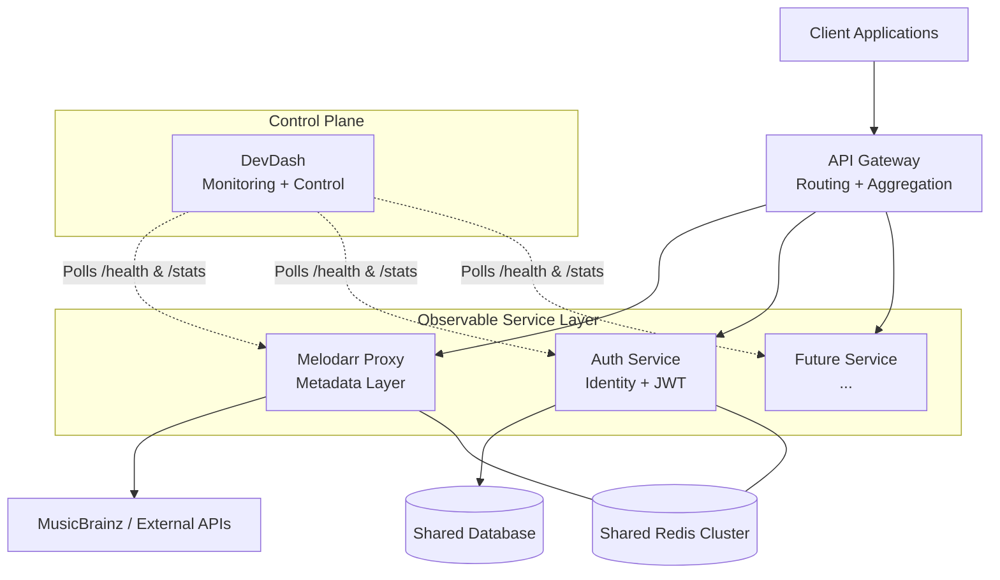

# 🏢 Multi-Service Platform Architecture

Melodarr Proxy is designed as the first node in a broader, observable service ecosystem. It establishes the baseline pattern for all future services built within this infrastructure.

This document outlines the architectural pattern ("Observable Service Layer") and the integration contract required for the overarching control plane (DevDash).

---

## 🏗 1. The "Observable Service Layer" Pattern

Every service transitioning from a standalone project to a platform node must adhere to a strict, standardized contract. This ensures predictable deployments, uniform monitoring, and seamless ecosystem integration.

### Core Philosophy

Every service must be:
1. **Independently deployable** (containerized, stateless where possible)
2. **Observable** (standardized health and metrics)
3. **Controllable** (exposed administrative actions)

### Required Service Capabilities

To be considered a "First-Class Platform Service," an application must implement:
* `GET /api/health` — Deep system health verification (dependencies, memory)
* `GET /api/stats` — Real-time performance metrics (RPM, latency, error rates)
* `GET /api/version` — Release identity and environment context
* **Structured Logging** — JSON-formatted logs for automated ingestion
* **Rate Limiting** — Abuse protection (if exposed externally)

### Architecture Flow



---

## 🧠 2. DevDash Integration Specification

**DevDash** acts as the central control plane. It does not manage the services directly; it observes them and issues control commands via their exposed APIs.

### Service Registry Definition

DevDash maintains a dynamic or static registry of all observable services. A sample registry configuration block looks like this:

```json
{
  "services": [
    {
      "name": "melodarr-proxy",
      "baseUrl": "http://localhost:3055",
      "endpoints": {
        "health": "/api/health",
        "stats": "/api/stats",
        "version": "/api/version",
        "control": {
          "start": "/api/proxy/start",
          "stop": "/api/proxy/stop"
        }
      }
    }
  ]
}
```

### Polling Strategy

DevDash implements an aggressive but efficient polling loop against registered services to maintain live state:
* **Health (`/api/health`)**: Every 5 seconds
* **Metrics (`/api/stats`)**: Every 10 seconds
* **History (`/api/stats/history`)**: Every 30 seconds

### Failure Handling & Degradation

Services are evaluated strictly based on their endpoint responses:
* **`health` fails or times out** → Service marked **DOWN** (🔴)
* **`stats` fails but `health` passes** → Service marked **DEGRADED** (🟡)
* **Timeouts** trigger an exponential backoff to prevent cascading failures.

### DevDash UI Requirements

For every registered service, DevDash must render a standard Service Card containing:

1. **Status Header**
   * Indicator: 🟢 Healthy / 🟡 Degraded / 🔴 Down
   * Uptime counter
   * Last successful check timestamp
2. **Metrics Panel**
   * Requests per minute (RPM)
   * Latency (Average & p95)
   * Error Rate (%)
   * Cache Hit Ratio (%)
3. **Control Actions**
   * Restart / Stop / Clear Cache (if supported by the service's control contract)

---

## 🚀 3. Strategic Advantage

By standardizing `health`, `stats`, and `control`, the ecosystem achieves:
* **Instant Onboarding:** Plug any new service into DevDash simply by providing its URL.
* **Unified Monitoring:** Look at one dashboard to understand the health of the entire stack.
* **Scale Without Chaos:** Infrastructure grows horizontally without introducing bespoke monitoring requirements for each new application.
